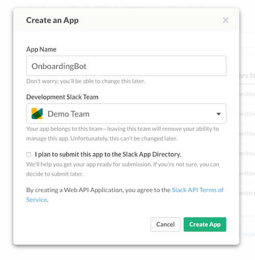
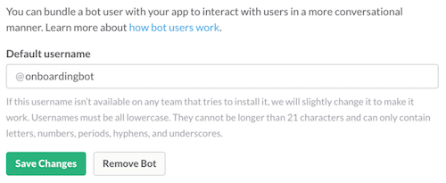
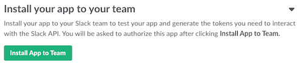
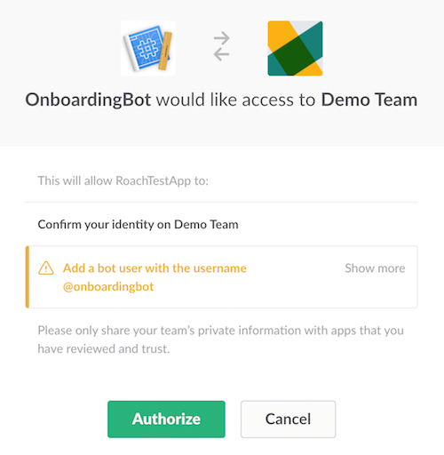
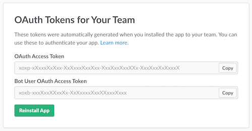
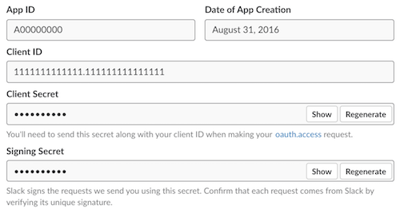
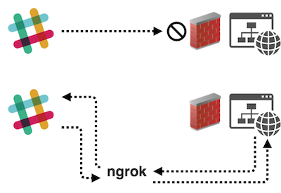
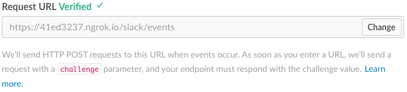
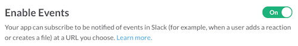

<div align="center">

# Slack Bot

<a href="https://github.com/ColombiaPython">
  
</a>

<!-- [![Build Status][build-badge]][build] -->
[![MIT License][license-badge]][LICENSE]
[](https://www.python.org/)
[![PRs Welcome][prs-badge]][prs] 
[](https://github.com/ColombiaPython/slack-bot/issues)
[](https://twitter.com/ColombiaPython)

Este es el repositorio de un Bot que obtiene información de un equipo en Slack y permite realizar funciones de administración para facilitar el manejo del grupo.

</div>

# 🔀 Flujo de trabajo

Hay 2 ramas de git, `develop` y `production`.

## ⤴️ Develop

Es la rama por defecto. Se hace Pull Request desde otra rama referente al issue o cambio que se quiera agregar, e.g. `issue-99` o `add-function`.

## ⤴️ Production

Después de que se han ejecutado las pruebas de calidad (QA), los cambios
realizados en la rama `develop` se unen con la rama `production`.

# 🛠 Desarrollo local

## ✅ (Opcional) Entorno Virtual

### Instalación

* Instalar [virtualenv](https://virtualenv.pypa.io/en/stable/installation/)

* ⚠️️ Requiere previa instalación de Python ⚠️

### Crear entorno virtual

```
$ virtualenv <nombre_entorno>
```

### Activar entorno virtual

#### Windows

```
$ <nombre_entorno>\Scripts\activate
```

#### Linux

```
$ source <nombre_entorno>/bin/activate
```

## ✅ Instala Dependencias

### Usando pip:
```
$ pip install -r requirements.txt
```

### Usando conda:

```
$ conda install --yes --file requirements.txt
```

### ✅ Crear y Configurar Bot

#### 🔧 Crear Slack app

Ingresar a `https://api.slack.com/apps/` y crear aplicación.



#### 🤖 Agregar usuario Bot a Slack app



#### 🔩 Instalar App en grupo de Slack

Visitar la página de instalación de la App creada y seleccionar __Install App to Team__.



Autorizar la instalación.



#### ⚙ Crear archivo de configuración

Renombrar el archivo `/src/config.json.example` como `/src/config.json`

#### ⚙ Guardar credenciales

Una vez se haya autorizado la aplicación, se mostrará la sección de Tokens de Autorización.



Copiar de __Bot User OAuth Access Token__ y agregarlo al atributo `token` en `config.json`

```
"config": {
    "name": "...",
    "token": "xxxXXxxXXxXXxXXXXxxxX.xXxxxXxxxx",
    ...
  },
  ...
```

En la página __Basic Information__ de la App:



Agregar información __Signing Secret__ al archivo `config.json`.

```
"config": {
    "name": "...",
    "token": "xxxXXxxXXxXXxXXXXxxxX.xXxxxXxxxx",
    "signin_secret": "xxxxxxxxXxxXxxXxXXXxxXxxx",
    ...
  },
  ...
```


<!-- ## ⁉️ Problemas comunes

* 🔴 Si en algun momento luego de instalar python3 y crear tu virtualenv. haces `lektor server` y ves este error:

```
RuntimeError: Click will abort further execution because Python 3 was configured to use ASCIas encoding for the environment.  Consult http://click.pocoo.org/python3/for mitigation steps.
```
Haz esto adentro de tu virtualenv:
```
export LC_ALL=en_us.UTF-8
export LANG=en_us.UTF-8
```

* 🔴 Si ves `jinja2.exceptions.UndefinedError: 'estimate_reading_time' is undefined` significa que necesitas instalar o reinstalar los `plugins` de lektor. Puedes hacer esto ejecutando

```
$ lektor plugins reinstall
``` -->

# 🚀 Despliegue

## ✔️ Desarrollo

### Ejecutar Bot

```
$ cd src/
$ python bot.py
```

### 🚧 Configuración Tunel

Al momento de Slack contactar el servidor local, se necesitará ejecutar un tunel. Se recomienda `ngrok` o `localtunnel`.



💡 Slack necesita que las peticiones de eventos se hagan sobre SSL, entonces necesitamos usar HTTPS URL, para esto nos apoyamos en las siguientes opciones.

#### Ngrok

> Instrucciones de instalación y configuración de [ngrok](https://ngrok.com/)

Ejecutar ngrok y copiar HTTPS URL

```
$ ngrok http 3000
ngrok by @inconshreveable (Ctrl+C to quit)

Session status                      online
Version                             2.1.18
Region                  United States (us)
Web Interface        http://127.0.0.1:4040

Forwarding http://h7465j.ngrok.io -> localhost:9292
Forwarding https://h7465j.ngrok.io -> localhost:9292
```

#### serveo.net (Opción recomendada)

```
$ ssh -R <subdominio>:80:localhost:3000 serveo.net 
```

### Suscribir la app a Eventos

Agregar la URL de peticiones (`tunnel URL + /slack/events`). Guardar y activar __Enable Events__.

_PENDIENTE: Lista de Eventos del Bot a activar._




<!-- ## ✔️✔️ Producción

```
$ lektor deploy production
```

Se desplegará el contenido de la rama `production` en `python.org.co` -->

<!-- # 📑 Guía de Uso

A nivel de edición contenido hay que tener en cuenta una [Guía de Uso del Sitio Web](./GUIA_DE_USO.md) ya que algunos contenidos tienen reglas especiales para poder ser agregados. -->

___
<div align="center">

💪 Colaboradores

|[<br /><sub><b>Alejandro E. Rendon</b></sub>](https://github.com/aerendon)|
| :---: |

</div>

[build-badge]: https://img.shields.io/travis/ColombiaPython/slack-bot.svg?style=flat-square
[build]: https://travis-ci.org/ColombiaPython/slack-bot
[license-badge]: https://img.shields.io/npm/l/all-contributors.svg?style=flat-square
[license]: https://github.com/ColombiaPython/slack-bot/blob/master/LICENSE
[prs-badge]: https://img.shields.io/badge/Issues-welcome-brightgreen.svg?style=flat-square
[prs]: https://github.com/ColombiaPython/slack-bot/issues/new

> Basado en [Slack Events API Python](https://github.com/slackapi/python-slack-events-api/blob/master/example/README.rst)